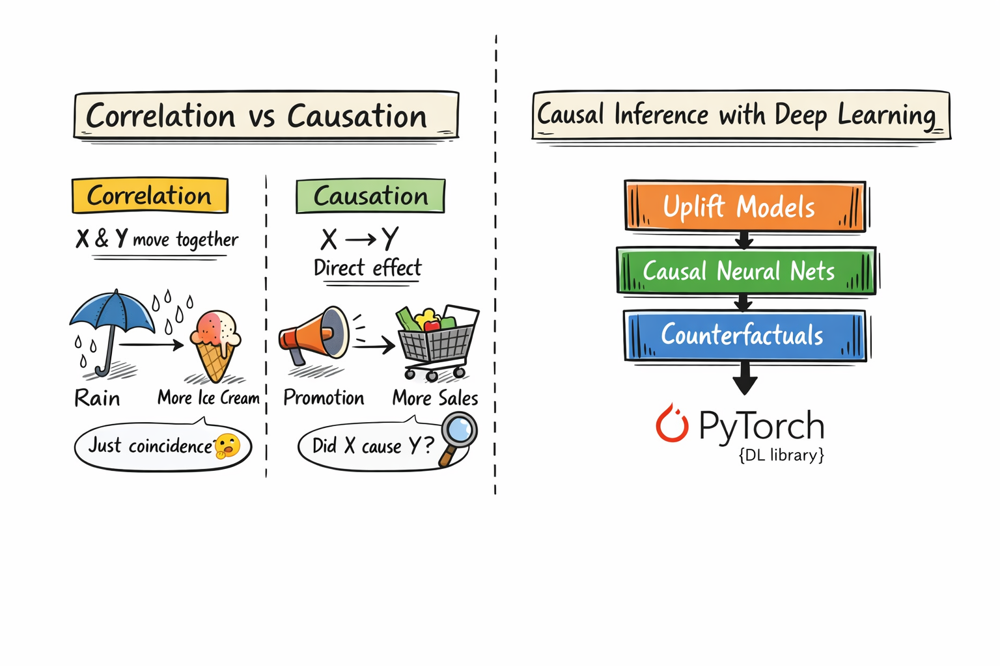

## 👋 Why this project? (a short story)

This project started from conversations with some friends who are economists.

While listening to them, I noticed something important:

👉 they are **not mainly interested in prediction**
👉 they really care about **causality**

They kept asking questions like:

- “Did the promotion actually **cause** people to buy more?”
- “Or were those customers already likely to buy anyway?”
- “Is this just a correlation, or an effect?”

That made me realize that a lot of classical machine learning answers the wrong question:

> 🤖 ML: *“Can I predict Y from X?”*  
> 🧠 Economists: *“Did X **cause** Y?”*

So I decided to dig into:

- causal inference
- counterfactual reasoning
- uplift modeling
- treatment effects (ATE, CATE, ITE)

And while exploring, I discovered something exciting:

> many state-of-the-art causal inference algorithms are **deep learning models**  
> and can be implemented using **PyTorch**

So this capstone became both:

- 🚀 a deep learning project
- 🧭 a journey into causality

I wanted to build something interactive where we can:
- simulate promotions
- measure causal impact
- explore counterfactuals for each customer


### 🎨 Correlation vs Causation — and where PyTorch fits



On the left:

- correlation → things move together, but maybe by coincidence  
- causation → changing X **actually changes Y**

On the right:

- uplift models  
- causal neural networks  
- counterfactual estimators  

➡ all implemented in **deep learning frameworks like PyTorch**

## 🗂 Project Structure
causal-promo-project/
│
├── app.py                         # Main Streamlit entry point
│
├── pages/                         # Multi-page Streamlit application
│   ├── 1_🏠_Introduction.py
│   ├── 2_📊_Synthetic_Dataset.py
│   ├── 3_🧠_Train_Deep_Model.py
│   ├── 4_🎯_ATE_and_CATE_Results.py
│   ├── 5_🔀_Counterfactual_Explorer.py
│   ├── 6_🧭_Causal_DAG_Viewer.py
│   ├── 7_📦_Export_Model_ONNX.py
│   └── 8_🌍_Real_Marketing_Dataset.py
│
├── data/
│   └── active_dataset.csv         # Currently loaded dataset (session persistence)
│
├── models/
│   └── saved_onnx_models/         # Optional exported ONNX models
│
├── src/
│   ├── training.py                # Training functions
│   ├── data_generation.py         # Synthetic data creation logic
│   └── utils.py                   # Helper functions
│
├── images/                        # Diagrams & README figures
│   └── causal_vs_correlation_pytorch.png
│
├── requirements.txt
└── README.md

## ▶️ How to run and use the app

### 1️⃣ Install and start

```bash
pip install -r requirements.txt
streamlit run app.py

git clone <your-repo-url>
cd causal-promo-project
python -m venv .env
# Windows
.env\Scripts\activate
# Linux/Mac
source .env/bin/activate
pip install -r requirements.txt
streamlit run app.py


## 🧭 Step-by-Step Guide Through the App

This project intentionally follows a complete causal-ML workflow:

1. define a question  
2. get or simulate data  
3. identify treatment and outcome  
4. train a causal deep learning model  
5. estimate treatment effects  
6. explore counterfactuals  
